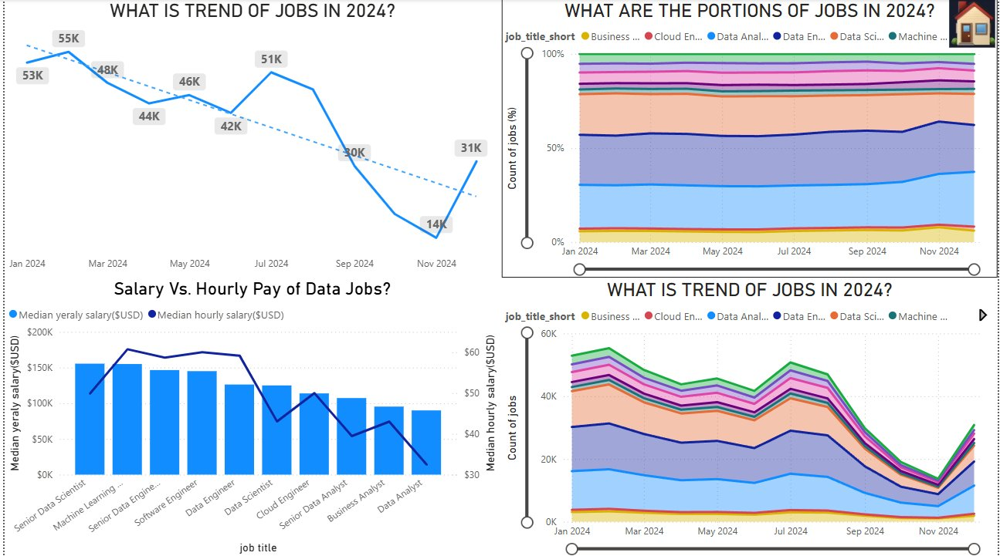
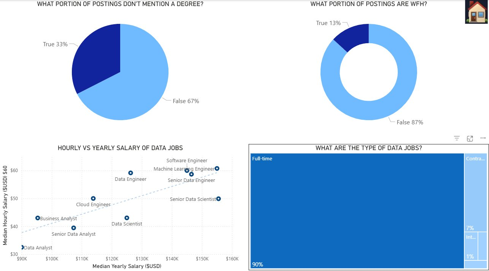
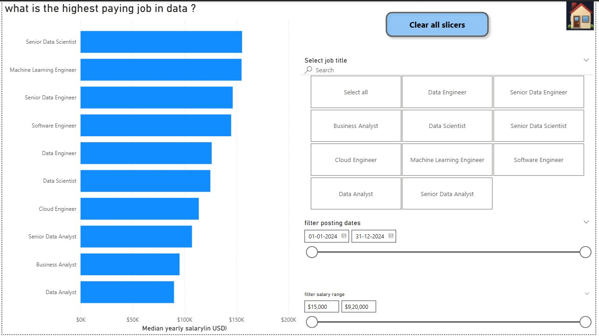
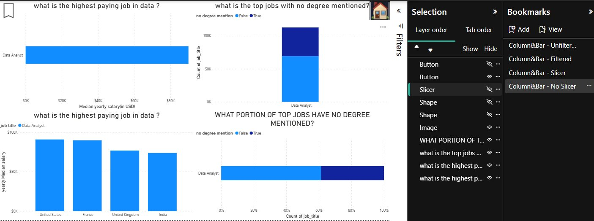

# Data Jobs Visualization Report 📊

A comprehensive Power BI report demonstrating 15+ visualization types applied to real-world job market data (479K job postings from 2024). The report features interactive navigation, bookmarks, slicers, and drill-through — built while completing Luke Barousse's Power BI for Data Analytics course.


---

## 📁 Project Structure

```
powerbi-visualizations-demo/
├── 2_visualizations.pbix       # Power BI report file
├── job_postings_flat.csv       # Dataset (479K job postings)
├── notes.ipynb                 # Detailed notes on how each visualization was built
├── images/                     # Screenshots of all report pages
└── README.md
```

---

## 📓 Notes

See `notes.ipynb` for detailed documentation on how each visualization was built.

---

## 🗂️ Report Pages

The report has an interactive home page with navigation buttons linking to each section.

### 🏠 Home — Navigation Page


---

### 📊 Column & Bar Charts
Answers: *What is the highest paying job in data? Which jobs have the most postings without degree requirements?*


---

### 📈 Line & Area Charts
Answers: *What is the trend of data jobs in 2024? What portion of jobs belong to each job title over time?*



---

### 🥧 Common Charts
Answers: *What portion of postings don't mention a degree? What portion are WFH? What are the types of data jobs?*



---

### 🗺️ Map Charts
Answers: *Where are job postings globally? Which countries don't mention degrees? Where are the highest paying jobs?*


---

### 🌊 Uncommon Charts
Includes Ribbon chart, Waterfall chart, and Funnel chart applied to job market data.


---

### 📋 Tables
Detailed tabular view of job postings with salary star ratings, company names, yearly salary, and job trends sparklines.


---

### 🃏 Cards
KPI cards showing median yearly salary, median hourly salary, and job counts broken down by job title.


---

### 🎛️ Slicers
Interactive filters for job title, posting date range, and salary range — all connected across the report.



---

### 🔖 Buttons & Bookmarks
Bookmarks used to toggle between filtered/unfiltered states and show/hide slicers dynamically.



---

## 📌 Key Features

- **Interactive navigation** — home page with buttons linking to each chart section
- **15+ visualization types** — column, bar, line, area, pie, donut, scatter, map, filled map, ribbon, waterfall, funnel, table, card, slicer
- **Bookmarks & buttons** — toggle views, show/hide slicers, reset filters
- **Slicers** — filter by job title, date range, and salary range across all visuals
- **Real questions answered** — every page answers a specific business question about the data jobs market

---

## 🗃️ Dataset

**Source:** Luke Barousse's Data Jobs Dataset  
**Size:** 479,000 job postings  
**Period:** January 2024 – December 2024  
**Fields include:** job title, company name, salary (yearly & hourly), location, job type, WFH status, degree requirement, health insurance, skills

---
## 📂 Data Source
Dataset sourced from [Luke Barousse's Data Jobs Dataset](https://drive.google.com/file/d/1xiNSeNRKiuTrCDmJbDo3ukom47HaBeQj/view?usp=drive_link) — 479K job postings from 2024.

---
## 📓 Notes
 
Detailed documentation on how each visualization was built, including design decisions and lessons learned.
 
👉 [View Notes on Google Colab](https://colab.research.google.com/drive/1l9vjSmjTugoo8AjMN7IMlOIiUhUHG57d)
 
---
## 🛠️ Tools Used

-- Power BI Desktop — report building, visualizations, bookmarks, slicers, buttons, navigation

---


## 🔗 Author

Arnav Heerakar
